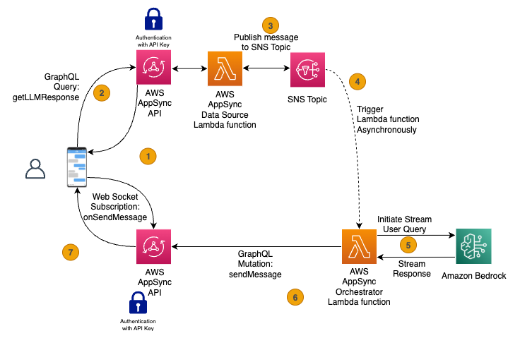

# Bedrock-streaming

This repository implements a streaming solution to get the LLM responses as Bedrock generates it, enableling the user with a better experience. The code implements the solution showed bellow:



### Important note
> Note, this repository is a sample solution for demo purpouses only. Not for Production deployment or sensitive workloads.
   > 1. Introspection queries are enabled since its intended for dev/test envrionment, usually its recommended to disable them for production deployments.
   > 2. In this repository we are using API key to authenticate to simplify the experiment setup. This is NOT a production pattern. Cognito or IAM based authentication are usualy recomended.
   > 3. For production deployments, consider putting proper guardrails  like bedrock guardrails to mitigate against injection type attacks like, prompt injection.

## Workspace Setup

Open one of the [bedrock-streaming](bedrock-streaming.code-workspace) VS Code workspace. To initiate your work environment run the [setup_workspace.sh](scripts/setup_workspace.sh) to setup your local VS Code workspace. This process installs Python virtual environment that is needed for unit tests.

```sh
./scripts/setup_workspace.sh
```

## Deployment

Deployment process documented uses terraform CLI for deployment.  However, TCB/E (Terraform for Cloud/Enterprise) can be used as well.

### Prerequisites

- Make sure that terraform is install on your machine or within the dev container. This repository was developped by using Terraform v1.7.4.
- In order to deploy the solution,  generate temporary credentials for your AWS account.  Edit your `~/.aws/credentials` file with the values.

```properties
[default]
aws_access_key_id = xyz
aws_secret_access_key = xyz
aws_session_token = xyz
```

- The solutions folder [deployment](deployment) contains the code to deploy the solution, using terraform. The deployment code entry point is the `main.tf` file. at the root of the project, you will find a sample `tfvars` that contains the necessary settings for deployment.

> NOTE: Don't forget to update the [sample.tfvars](deployment/sample.tfvars)

### Deploy the solution

The first step of the deployment is to modify the `sample.tfvars`.

The only variable you need to edit are related to the deployment bucket:
```sh
lambda_s3_source_bucket_name = "YOUR_DEPLOYMENT_BUCKET"
lambda_s3_source_bucket_key  = "PREFIX_WITHIN_THE_BUCKET"
```
Replace the above by a bucket name and prefix, in the region specified on the top of the `sample.tfvars`. (us-west-2 by default)

Open a terminal in the root of the terraform folder [deployment](deployment) containing the `main.tf` file.

The `terraform init` command initializes a working directory containing Terraform configuration files. This is the first command that should be run after writing a new Terraform configuration or cloning an existing one from version control. It is safe to run this command multiple times. - from [terraform documentation](https://developer.hashicorp.com/terraform/cli/commands/init)

```sh
terraform init
```

The `terraform plan` command creates an execution plan, which lets you preview the changes that Terraform plans to make to your infrastructure. - from [terraform documentation](https://developer.hashicorp.com/terraform/cli/commands/plan)

```sh
terraform plan -var-file="sample.tfvars"
```

The `terraform apply` command executes the actions proposed in a Terraform plan. - from [terraform documentation](https://developer.hashicorp.com/terraform/cli/commands/apply)

```sh
terraform apply -var-file="sample.tfvars"
```

To destroy the applied resources, run the `terraform destroy` command.

```sh
terraform destroy -var-file="sample.tfvars"
```

## Test solution in UI

### Local Development with localhost

To run the UI locally for development:

1. Navigate to the chat-bot-ui directory:
   ```sh
   cd chat-bot-ui
   ```

2. Install dependencies:
   ```sh
   yarn install
   ```

3. Update the API endpoint configuration in your local environment to point to your deployed backend:
   - Modify the WebSocket endpoint in the `.vscode/tasks.json` file to use your deployed AppSync
   - Update the API_KEY value with the API key from your AWS Console (AWS AppSync > APIs > bedrock-gql-api-bedrock-streaming > settings > API Keys)
   - Update other endpoint values (API_ENDPOINT, GRAPHQL_ENDPOINT) with your deployed API URLs

   Example of what to update in [tasks.json](./chat-bot-ui/.vscode/tasks.json):
   ```json
   "env": {
      "GRAPHQL_ENDPOINT": "https://abcdef.appsync-api.us-west-2.amazonaws.com/graphql",
      "GRAPHQL_API_KEY": "your-api-key-from-aws-console",
   }
   ```
> Note: If you are deploying this in a production environment, make sure to store those credentials (e.g. API key) in a secret store (e.g. AWS Secrets Manager)

4. There are two ways to start the development server:

   **Option A: Using yarn directly**
   ```sh
   yarn run start-dev
   ```

   **Option B: Using VS Code tasks**
   - Make sure to open the [vs code workspace](./bedrock-streaming.code-workspace)
   - Open VS Code and press `Ctrl+Shift+P` (or `Cmd+Shift+P` on Mac)
   - Type "Tasks: Run Task" and select it
   - Choose one of the following tasks:
     - `chat-bot-ui:start-dev-server` - For standard development
     - `chat-bot-ui:start-demo-server` - For demo mode

5. The UI will be available at http://localhost:8080 in your browser.

This local setup is ideal for UI development as it provides hot-reloading and easier debugging capabilities. The VS Code tasks are configured in `.vscode/tasks.json` and provide different environment configurations for various development scenarios.